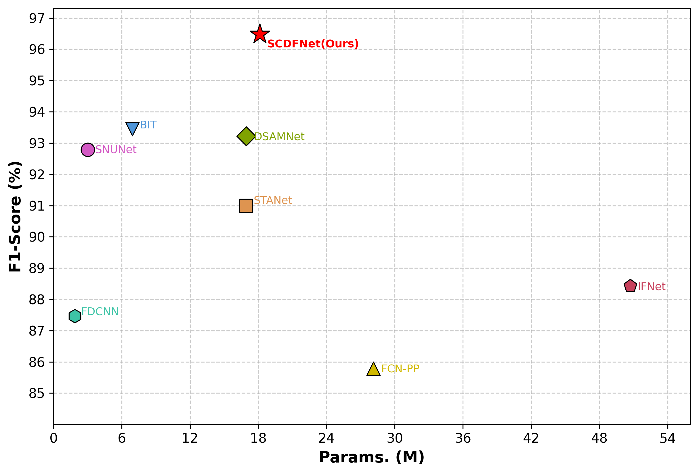
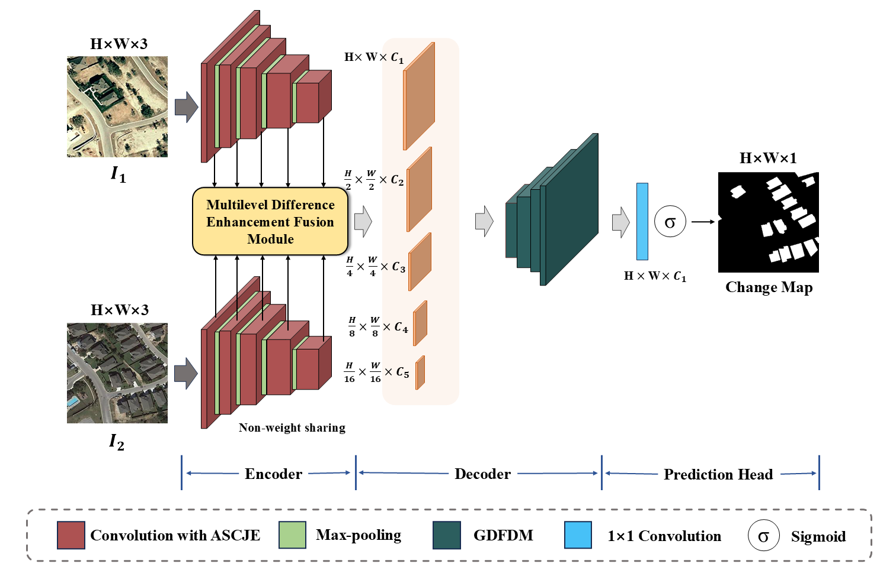
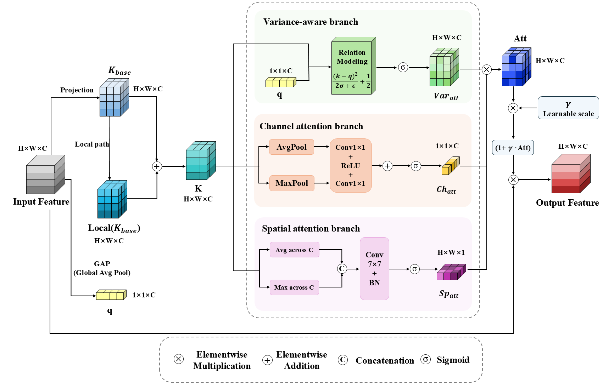
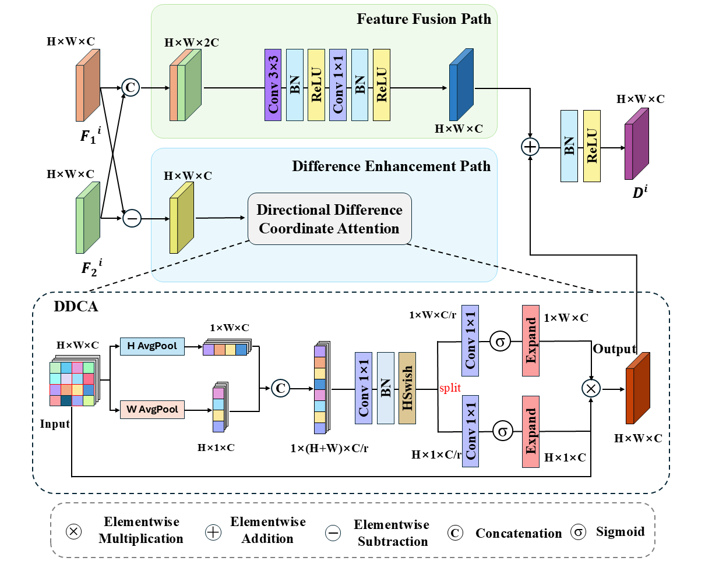
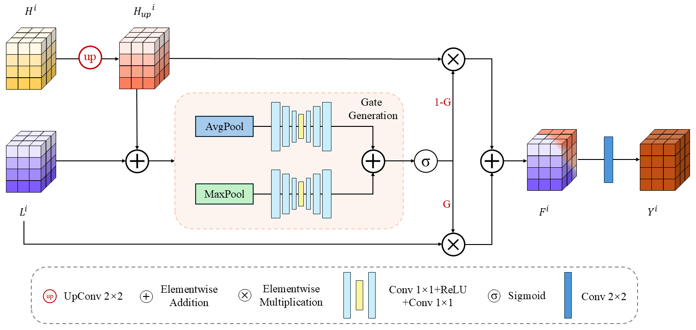
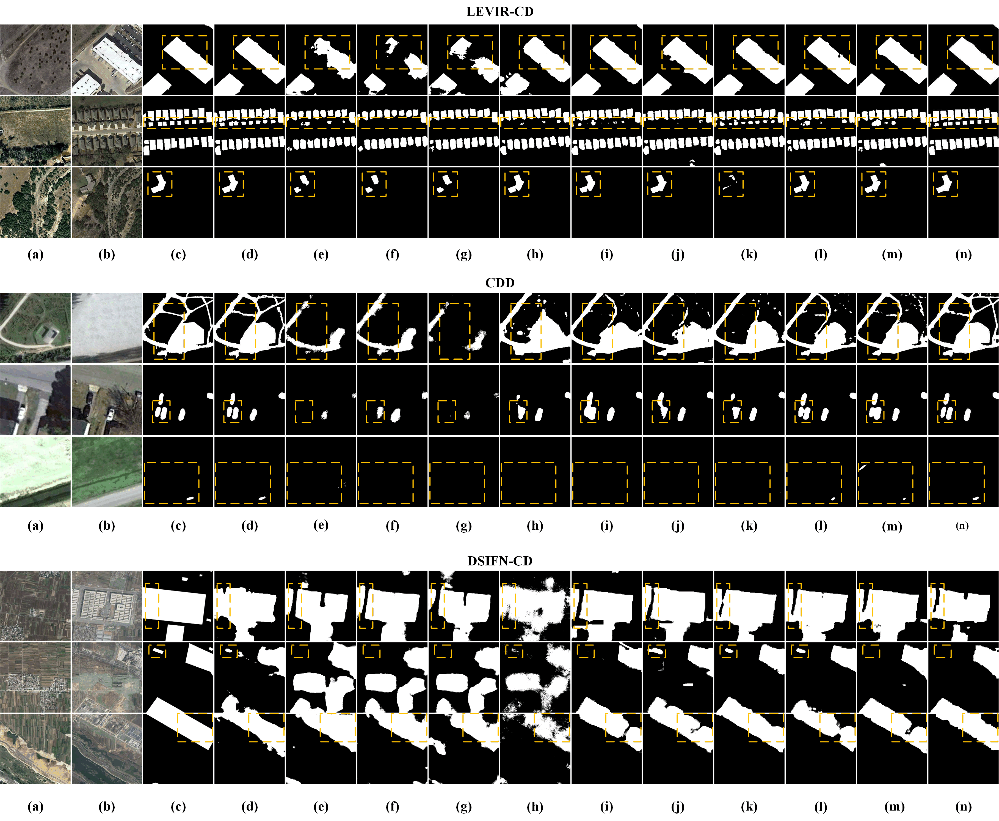
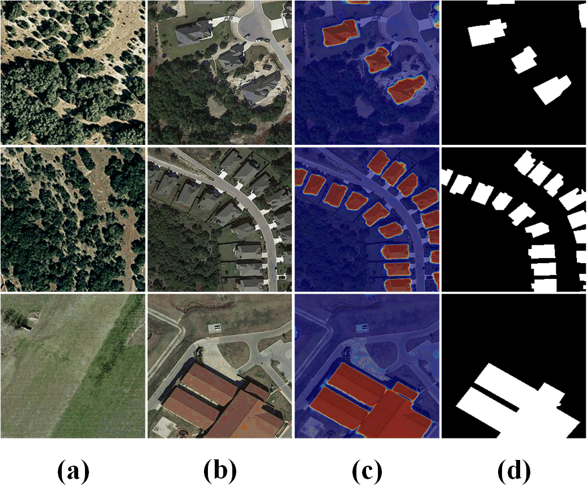

<div align="center">

<h2>SCDF-Net: Spatial-Channel Difference Fusion Network for Remote Sensing Image Change Detection</h2>

**_A compact and effective framework for binary change detection in high-resolution remote sensing images._**

Jiacheng Wang

<div align="center">


</div>

</div>

<div align="center">

</div>

## Highlights

- **Spatial-channel feature enhancement:** SCDF-Net introduces an Adaptive Spatial-Channel Joint Enhancement module (ASCJE) to recalibrate multi-scale features and suppress redundant background responses.
- **Explicit bitemporal difference modeling:** The Multilevel Difference Enhancement Fusion Module (MDEFM) combines feature concatenation and directional difference enhancement to capture reliable cross-temporal changes.
- **Gated decoding:** The Gated Difference Fusion Decoder Module (GDFDM) adaptively balances high-level semantic difference features and low-level detail features.
- **Strong accuracy-efficiency tradeoff:** SCDF-Net achieves competitive performance with **18.12M** parameters and **15.31G** FLOPs on 256x256 inputs.

## Abstract

Remote sensing image change detection aims to identify land-cover changes from a pair of bitemporal images. Although convolutional neural networks have achieved promising results, complex high-resolution scenes still suffer from redundant multi-scale background textures, pseudo-change responses, weak bitemporal difference modeling, and degraded boundary details during decoding.

To address these issues, we propose **SCDF-Net**, a Spatial-Channel Difference Fusion Network. SCDF-Net adopts a non-weight-sharing pseudo-Siamese encoder to extract bitemporal multi-level features. ASCJE dynamically generates spatial and channel attention weights to enhance change-related responses. MDEFM explicitly strengthens multi-level bitemporal difference features through a difference enhancement path and a feature fusion path. GDFDM further performs gated top-down decoding to fuse semantic difference features and fine-grained spatial details. Experiments on three public remote sensing change detection datasets demonstrate that SCDF-Net achieves strong performance while maintaining a favorable balance between accuracy and model complexity.

## Framework

### Overall Architecture

<div align="center">

</div>

SCDF-Net consists of three main stages: a non-weight-sharing bitemporal encoder, multilevel difference enhancement, and gated prediction decoding. Given two input images T1 and T2, the network extracts multi-level features from both temporal branches, generates enhanced difference features at each level, and reconstructs the final binary change map through the decoder.

### Adaptive Spatial-Channel Joint Enhancement Module

<div align="center">

</div>

ASCJE performs adaptive feature recalibration through a variance-aware branch, a channel attention branch, and a spatial attention branch. The enhanced attention response is applied in a residual manner to preserve the original feature representation while highlighting informative regions and channels.

### Multilevel Difference Enhancement Fusion Module

<div align="center">

</div>

MDEFM models bitemporal changes from two complementary perspectives. The feature fusion path preserves contextual information from both temporal features, while the difference enhancement path emphasizes directional coordinate-aware feature differences.

### Gated Difference Fusion Decoder Module

<div align="center">

</div>

GDFDM uses a learnable gate to control the contribution of high-level semantic features and low-level detailed features during decoding, improving the completeness and boundary quality of detected changes.

## Performance

We evaluate SCDF-Net on three public binary change detection datasets: **LEVIR-CD**, **CDD**, and **DSIFN-CD**. Precision (Pre), Recall (Rec), and F1-score (F1) are used as evaluation metrics.

| Method | Params (M) | FLOPs (G) | LEVIR Pre | LEVIR Rec | LEVIR F1 | CDD Pre | CDD Rec | CDD F1 | DSIFN Pre | DSIFN Rec | DSIFN F1 |
| --- | ---: | ---: | ---: | ---: | ---: | ---: | ---: | ---: | ---: | ---: | ---: |
| FC-EF | 0.85 | 3.34 | 74.96 | 90.53 | 82.01 | 52.67 | 84.20 | 64.80 | 50.01 | 55.99 | 52.84 |
| FC-Siam-Di | 0.85 | 3.33 | 78.18 | 92.92 | 84.92 | 61.85 | 76.69 | 68.48 | 52.62 | 56.94 | 54.69 |
| FC-Siam-Conc | 1.07 | 4.08 | 74.32 | 91.63 | 82.07 | 44.07 | 80.44 | 56.94 | 48.67 | 56.19 | 52.16 |
| FCN-PP | 28.13 | 34.65 | 80.31 | 89.48 | 84.64 | 81.69 | 90.31 | 85.78 | 56.42 | 59.25 | 57.80 |
| STANet | 16.93 | 6.58 | 86.14 | 89.39 | 87.73 | 88.98 | 93.11 | 91.00 | 66.22 | 67.16 | 66.69 |
| IFNet | 50.71 | 41.18 | 87.55 | 86.52 | 87.03 | 85.33 | 91.76 | 88.43 | **72.36** | 63.86 | 67.85 |
| FDCNN | 1.86 | 32.40 | 82.99 | 88.71 | 85.76 | 83.61 | 91.70 | 87.47 | 64.42 | 68.38 | 66.34 |
| SNUNet | 3.01 | 27.44 | 84.66 | 91.34 | 87.87 | 90.92 | 94.75 | 92.79 | 62.47 | 69.74 | 65.90 |
| DSAMNet | 16.95 | 75.29 | 82.75 | 88.39 | 85.48 | 91.67 | 94.83 | 93.22 | 61.28 | **75.41** | 67.62 |
| BIT | 6.93 | 8.44 | 89.24 | 89.37 | 89.31 | 92.89 | 94.02 | 93.45 | 68.36 | 70.18 | 69.26 |
| **SCDF-Net (ours)** | **18.12** | **15.31** | **90.79** | **91.80** | **91.29** | **96.20** | **96.72** | **96.48** | 68.85 | 72.61 | **70.68** |

<div align="center">

</div>

### Ablation Study

The ablation experiments are conducted on the CDD dataset.

| Setting | ASCJE | MDEFM | GDFDM | Params (M) | FLOPs (G) | F1 (%) |
| --- | :---: | :---: | :---: | ---: | ---: | ---: |
| Baseline | - | - | - | 1.52 | 4.86 | 95.73 |
| +ASCJE | yes | - | - | 1.99 | 5.43 | 95.98 |
| +ASCJE+MDEFM | yes | yes | - | 15.34 | 18.26 | 96.40 |
| **SCDF-Net** | **yes** | **yes** | **yes** | **18.12** | 15.31 | **96.48** |

### Qualitative Results

<div align="center">

</div>

<div align="center">

</div>

## How to Use

### Installation

```bash
conda create -n scdfnet python=3.8
conda activate scdfnet
pip install torch torchvision torchaudio
pip install -r requirements.txt
```

### Data Preparation

Download the public datasets:

- [LEVIR-CD](https://chenhao.in/LEVIR/)
- CDD
- DSIFN-CD

Prepare each dataset in the following format:

```text
datasets/
  LEVIR-CD/
    train/
      t1/
      t2/
      label/
    val/
      t1/
      t2/
      label/
    test/
      t1/
      t2/
      label/
```

All images are cropped or resized to **256x256** during training and evaluation.

### Training

Training on LEVIR-CD as an example:

```bash
python train.py \
  --dataset LEVIR-CD \
  --data_root ./datasets/LEVIR-CD \
  --epochs 200 \
  --batch_size 32 \
  --lr 1e-4 \
  --weight_decay 5e-4
```

### Evaluation

```bash
python test.py \
  --dataset LEVIR-CD \
  --data_root ./datasets/LEVIR-CD \
  --checkpoint ./checkpoints/scdfnet_levir.pth
```

### Inference

```bash
python infer.py \
  --t1 path/to/t1.png \
  --t2 path/to/t2.png \
  --checkpoint ./checkpoints/scdfnet.pth \
  --save_path ./results/change_map.png
```

## Implementation Details

- Framework: PyTorch
- Input size: 256x256
- Optimizer: Adam
- Learning rate: 0.0001
- Weight decay: 0.0005
- Batch size: 32
- Training epochs: 200
- Loss function: Binary Cross-Entropy loss
- Output: one-channel change probability map with Sigmoid activation

## Acknowledgements

Thanks to the maintainers of the public remote sensing change detection datasets and the open-source implementations of representative methods such as FC-Siam, STANet, IFNet, SNUNet, DSAMNet, and BIT.

## License

This project is released for academic research. Please check the repository license before using the code for commercial purposes.

## Citation

If you find this work useful, please consider citing:

```bibtex
@article{wang2026scdfnet,
  title   = {SCDF-Net: Spatial-Channel Difference Fusion Network for Remote Sensing Image Change Detection},
  author  = {Wang, Jiacheng},
  journal = {Manuscript},
  year    = {2026}
}
```
