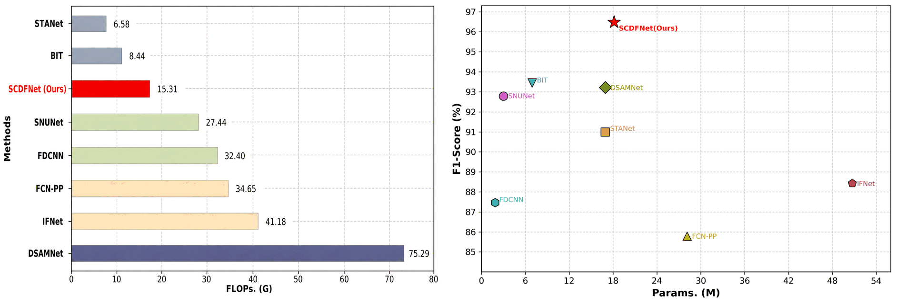

<div align="center">

<h1>SCDFNet: Spatial-Channel Difference Fusion Network for Remote Sensing Image Change Detection</h1>

<p><em>A progressive difference representation network for reliable and efficient remote sensing image change detection.</em></p>

<p>
  
  
  
  
  
</p>

</div>

<div align="center">
  
</div>

## Overview

Remote sensing image change detection identifies land-cover changes from a pair of bitemporal images. In high-resolution scenes, nuisance responses can be amplified during temporal comparison, while direct differencing and fixed multi-level fusion often struggle to preserve both change semantics and fine spatial details.

SCDFNet addresses these issues through a continuous change-information flow. It first builds reliability-enhanced spatial-channel representations, then couples explicit temporal discrepancy with complementary bitemporal context, and finally performs difference-conditioned reconstruction to coordinate high-level semantics with low-level spatial details.

## Highlights

- **Progressive difference representation:** feature enhancement, temporal comparison, and decoding are organized as successive stages instead of isolated operations.
- **Adaptive Spatial-Channel Joint Enhancement Module (ASCJE):** jointly models response variation, channel importance, and spatial saliency before temporal comparison.
- **Multi-level Difference Enhancement Fusion Module (MDEFM):** combines contextual evidence with directionally enhanced absolute-difference evidence at all five encoder levels.
- **Gated Difference Fusion Decoder Module (GDFDM):** learns difference-conditioned gates that balance high-level semantic evidence and low-level spatial detail during reconstruction.
- **Accuracy-efficiency balance:** SCDFNet reaches 91.29% F1 on LEVIR-CD and 96.48% F1 on CDD with 18.12M parameters and 15.31G FLOPs.

## Architecture

SCDFNet uses two independent encoder branches to extract five levels of bitemporal features. MDEFM constructs a unified difference representation at each level, and four GDFDM stages progressively reconstruct the change map. A 1x1 convolution followed by Sigmoid produces the final change probability map.

### Adaptive Spatial-Channel Joint Enhancement Module

<div align="center">
  
</div>

ASCJE couples three complementary responses in a residual enhancement mechanism: a variance-aware spatial response, channel attention, and spatial attention. Their multiplicative interaction forms a joint reliability mask that suppresses unreliable responses while preserving the original temporal representation.

### Multi-level Difference Enhancement Fusion Module

<div align="center">
  
</div>

MDEFM treats bitemporal change modeling as a dual-evidence problem. A feature-fusion path preserves the joint temporal context, while an absolute-difference path uses Directional Difference Coordinate Attention (DDCA) to encode horizontal and vertical dependencies. The enhanced discrepancy is injected into the contextual representation to form a unified multi-level difference feature.

### Gated Difference Fusion Decoder Module

<div align="center">
  
</div>

GDFDM upsamples the high-level difference feature and generates a gate from its joint response with the corresponding low-level feature. The gate adaptively controls the contribution of semantic and detailed evidence before refinement, improving both region completeness and boundary quality.

## Experimental Setup

### Datasets

| Dataset | Patch size | Training | Validation | Testing |
| --- | ---: | ---: | ---: | ---: |
| LEVIR-CD | 256x256 | 10,000 | 1,024 | 2,048 |
| CDD | 256x256 | 10,000 | 3,000 | 3,000 |
| DSIFN-CD | 512x512 | 3,600 | 340 | 48 |

### Implementation Details

| Item | Setting |
| --- | --- |
| Framework | PyTorch |
| Training hardware | NVIDIA L20 GPU |
| Optimizer | Adam |
| Epochs | 200 |
| Batch size | 32 |
| Initial learning rate | 1e-4 |
| Weight decay | 5e-4 |
| Loss | Binary Cross-Entropy (BCE) |
| Inference threshold | 0.5 |
| Complexity protocol | One bitemporal 256x256 image pair, batch size 1 |

Precision (Pre), Recall (Rec), and F1-score (F1) are used as evaluation metrics.

## Benchmark Results

The best result in each dataset/metric column is shown in bold.

| Method | Params (M) | FLOPs (G) | LEVIR Pre | LEVIR Rec | LEVIR F1 | CDD Pre | CDD Rec | CDD F1 | DSIFN Pre | DSIFN Rec | DSIFN F1 |
| --- | ---: | ---: | ---: | ---: | ---: | ---: | ---: | ---: | ---: | ---: | ---: |
| FC-EF | 0.85 | 3.34 | 74.96 | 90.53 | 82.01 | 52.67 | 84.20 | 64.80 | 50.01 | 55.99 | 52.84 |
| FC-Siam-Di | 0.85 | 3.33 | 78.18 | **92.92** | 84.92 | 61.85 | 76.69 | 68.48 | 52.62 | 56.94 | 54.69 |
| FC-Siam-Conc | 1.07 | 4.08 | 74.32 | 91.63 | 82.07 | 44.07 | 80.44 | 56.94 | 48.67 | 56.19 | 52.16 |
| FCN-PP | 28.13 | 34.65 | 80.31 | 89.48 | 84.64 | 81.69 | 90.31 | 85.78 | 56.42 | 59.25 | 57.80 |
| STANet | 16.93 | 6.58 | 86.14 | 89.39 | 87.73 | 88.98 | 93.11 | 91.00 | 66.22 | 67.16 | 66.69 |
| IFNet | 50.71 | 41.18 | 87.55 | 86.52 | 87.03 | 85.33 | 91.76 | 88.43 | 72.36 | 63.86 | 67.85 |
| FDCNN | 1.86 | 32.40 | 82.99 | 88.71 | 85.76 | 83.61 | 91.70 | 87.47 | 64.42 | 68.38 | 66.34 |
| SNUNet | 3.01 | 27.44 | 84.66 | 91.34 | 87.87 | 90.92 | 94.75 | 92.79 | 62.47 | 69.74 | 65.90 |
| DSAMNet | 16.95 | 75.29 | 82.75 | 88.39 | 85.48 | 91.67 | 94.83 | 93.22 | 61.28 | 75.41 | 67.62 |
| BIT | 6.93 | 8.44 | 89.24 | 89.37 | 89.31 | 92.89 | 94.02 | 93.45 | 68.36 | 70.18 | 69.26 |
| ChangeMamba | 85.53 | 179.32 | 91.01 | 89.36 | 90.18 | 96.44 | 93.43 | 94.91 | **91.23** | **89.21** | **90.21** |
| CDMamba | 12.71 | 151.23 | **91.42** | 89.42 | 90.41 | 94.78 | 94.90 | 94.84 | 87.98 | 83.74 | 85.81 |
| **SCDFNet (ours)** | 18.12 | 15.31 | 90.79 | 91.80 | **91.29** | **96.77** | **96.20** | **96.48** | 68.85 | 72.61 | 70.68 |

SCDFNet obtains the highest F1-scores on LEVIR-CD and CDD. On DSIFN-CD, it outperforms all compared CNN-based methods and BIT, while the two Mamba-based baselines remain stronger on this more heterogeneous dataset.

### Accuracy-Complexity Comparison on CDD

<div align="center">
  
</div>

Compared with ChangeMamba, SCDFNet reduces the parameter count by 78.81% and FLOPs by 91.46%. Although it has more parameters than CDMamba, it requires 89.88% fewer FLOPs. This provides a favorable balance among detection accuracy, parameter count, and computation.

## Ablation Study

The complete module-level ablation covers all eight possible configurations on CDD.

| Setting | ASCJE | MDEFM | GDFDM | Params (M) | FLOPs (G) | F1 (%) |
| --- | :---: | :---: | :---: | ---: | ---: | ---: |
| Baseline | - | - | - | 1.52 | 4.86 | 95.73 |
| +ASCJE | ✓ | - | - | 1.99 | 5.43 | 95.98 |
| +MDEFM | - | ✓ | - | 14.87 | 17.69 | 96.02 |
| +GDFDM | - | - | ✓ | 4.30 | 1.91 | 95.87 |
| +ASCJE+MDEFM | ✓ | ✓ | - | 15.34 | 18.26 | 96.30 |
| +ASCJE+GDFDM | ✓ | - | ✓ | 4.77 | 2.48 | 96.12 |
| +MDEFM+GDFDM | - | ✓ | ✓ | 17.65 | 14.74 | 96.18 |
| **SCDFNet** | ✓ | ✓ | ✓ | 18.12 | 15.31 | **96.48** |

ASCJE, MDEFM, and GDFDM individually improve the baseline, and their paired configurations show complementary benefits. The complete model improves F1 by 0.75 percentage points over the baseline and by 0.18 points over the strongest two-module configuration. Adding GDFDM to ASCJE+MDEFM also reduces FLOPs from 18.26G to 15.31G while improving accuracy.

## Qualitative Results

<div align="center">
  
</div>

SCDFNet produces more complete changed regions and clearer boundaries, with fewer missed detections and false alarms in dense changes, irregular boundaries, and small-object scenes.

### Activation Visualization

<div align="center">
  
</div>

## Getting Started

### Installation

```bash
git clone https://github.com/LUORioet/SCDF-Net.git
cd SCDF-Net

conda create -n scdfnet python=3.8 -y
conda activate scdfnet
pip install -r requirements.txt
pip install tensorboardX
```

### Data Preparation

Download the public datasets:

- [LEVIR-CD](https://justchenhao.github.io/LEVIR/)
- [CDD](https://drive.google.com/file/d/1GX656JqqOyBi_Ef0w65kDGVto-nHrNs9/edit?pli=1)
- [DSIFN-CD](https://github.com/GeoZcx/A-deeply-supervised-image-fusion-network-for-change-detection-in-remote-sensing-images/tree/master/dataset)

The folder names expected by the dataset blocks in `path.py` are:

| Dataset | Time 1 | Time 2 | Label |
| --- | --- | --- | --- |
| LEVIR-CD | `A` | `B` | `label` |
| CDD | `A` | `B` | `OUT` |
| DSIFN-CD | `t1` | `t2` | `mask` |

For example, the currently active CDD configuration expects:

```text
CDD/
├── train/
│   ├── A/
│   ├── B/
│   └── OUT/
├── val/
│   ├── A/
│   ├── B/
│   └── OUT/
└── test/
    ├── A/
    ├── B/
    └── OUT/
```

Files in the two temporal folders and the label folder must have matching names. The current loader does not crop or resize images automatically, so prepare the patches at the sizes listed in the experimental setup.

### Configure a Dataset

1. Open `path.py`.
2. Uncomment the block for the target dataset and set its root path.
3. Comment out the other dataset blocks so that only one set of path variables is active.
4. Update `TITLE` in `main.py` to identify the dataset and experiment in logs and checkpoints.

### Training

```bash
python run.py --batch_size 32 --lr 0.0001 --epochs 200
```

The `--input_h` and `--input_w` options only control the input size used for complexity reporting; they do not resize training samples.

Checkpoints are saved under `ckps/<TITLE>/`, and TensorBoard logs are written to `runs/<TITLE>/`.

### Evaluation

1. Configure the test paths in `path.py`.
2. Set `model_path` in `predict.py` to the checkpoint to evaluate.
3. Run:

```bash
python predict.py
```

## Project Structure

```text
SCDF-Net/
├── assets/                  # Architecture and result figures
├── networks/
│   ├── modules/             # ASCJE-related building blocks
│   └── SCDFNet.py           # SCDFNet, MDEFM, and GDFDM
├── dataset.py               # Bitemporal dataset loader
├── main.py                  # Training and validation pipeline
├── operation.py             # Train, validation, and prediction loops
├── path.py                  # Dataset path configuration
├── predict.py               # Checkpoint evaluation
├── run.py                   # Command-line training entry point
├── run.sh                   # Example training command
└── requirements.txt
```

## Citation

Citation information will be added after publication.

## Acknowledgements

We thank the maintainers of the public remote sensing change detection datasets and the authors of the representative comparison methods.

## License

This project is released for academic research. Please check the repository license before commercial use.

